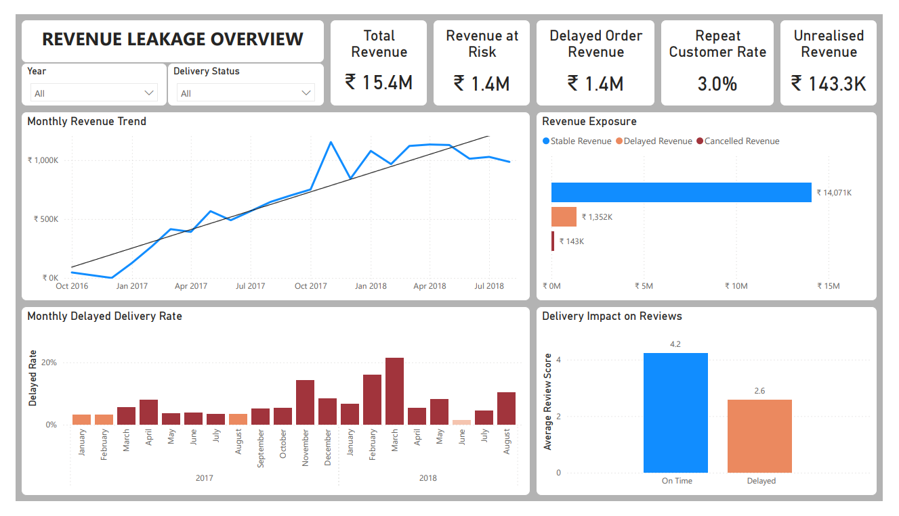

# Revenue Leakage Analysis
**Analyzing where revenue is lost in an e-commerce business by examining customer behavior, delivery performance, and operational processes.**

## Overview

This project investigates potential revenue leakage in an e-commerce business using transaction level data. The goal is to understand whether revenue growth is sustainable or if operational gaps are causing hidden losses.

The analysis focuses on three key areas:
- Customer purchasing behavior
- Customer experience and delivery performance
- Operational and seller related issues

By identifying these leakage points, the project highlights where the business can improve stability and long term revenue growth.

## Problem Statement

The business is generating consistent revenue and attracting new customers. However, there are concerns about the stability and long-term sustainability of this growth.

Management wants to understand whether revenue is being affected by gaps in customer retention, delivery performance, or operational processes, and assess the overall impact on business growth.

## Objective

The objective of this analysis is to **identify where revenue is leaking** across the business, quantify the impact of each leakage area, and highlight which issues need immediate attention to stabilize and improve revenue growth.

## Dataset Overview

This analysis uses a public e-commerce dataset that captures end-to-end order activity.

**Dataset:** [Brazilian E-Commerce Public Dataset by Olist](https://www.kaggle.com/datasets/olistbr/brazilian-ecommerce)

The dataset contains multiple tables representing the full order lifecycle including:

`customers` ▪ `location` ▪ `order_items` ▪ `payments` ▪ `reviews` ▪ `orders` ▪ `product` ▪ `seller` ▪ `product_category`

> The `9 csv` files were structured into a relational **SQLite database**, enabling multi-table joins and revenue analysis using SQL queries.

## Tool and Technologies

`Python` ▪ `SQL` ▪ `SQLite` ▪ `Pandas` ▪ `Matplotlib` ▪ `Seaborn` ▪ `Jupyter Notebook` ▪ `Power BI`

## Methods

The analysis follows these steps:
1. Loaded the raw CSV files into Python.
2. Created a relational SQLite database to organize the data into structured tables.
3. Used SQL joins to connect customer, order, payment, review, and seller information.
4. Computed metrics related to revenue generation, delivery performance, and operational failures.
5. Visualized selected insights using Python plotting libraries.
6. Compiled the insights into a Power BI Dashboard for easy interpretation and review.

## Analysis and Key Insights

### Stage 01 : Customer Behavior Leakage

This stage focuses on understanding how customer purchasing patterns impact revenue sustainability, especially repeat purchases.

**Insights:**

- **97% of customers** are one time buyers
- **94.4% of total revenue** worth **14.5M** comes from one time buyers
- Average revenue per repeat customer is **nearly 2 times higher** than one time customers

> Revenue is acquisition-driven rather than retention-driven, increasing long-term dependency on continuous customer acquisition.

### Stage 02 : Experience Driven Leakage

This stage evaluates how delivery delays and poor experience affect customer satisfaction and future revenue.

**Insights:**

- **8.11% of orders** were delivered later than expected, affecting `8.32%` of customers
- **8.76% of total revenue**, worth **1.35 million** is associated with delayed deliveries
- Average review score drops from `4.29` for on time deliveries to `2.56` for late deliveries

> Late deliveries significantly reduce review scores, indicating potential risk to future customer retention.

### Stage 03 : Operational and Seller Side Leakage

This stage analyzes revenue loss caused by internal operational failures and seller performance.

**Insights:**

- **0.14 million** revenue is directly lost due to order cancellations
- Only **4 sellers** consistently cause delivery delays
- Revenue linked to poor seller performance is very small compared to total delayed delivery revenue
- Top sellers contribute only **12.9%** of total revenue

> Direct revenue loss from cancellations exceeds revenue concentration risk from seller-driven delays.

## Interactive Dashboard
 
The dashboard summarizes key insights on revenue leakage across customer behavior, delivery performance, and operational processes.

  

[Click here to view the full multi-page PDF dashboard](dashboard/Revenue_Leakage_Dashboard.pdf)

## Data-Driven Action Points

- Since 94.4% of revenue comes from customers who purchase only once, the business should track how many customers place a second order and focus on increasing repeat purchases.
- Instead of reviewing all sellers, closely monitor the 4 sellers who regularly cause delivery delays and take corrective action there.
- Analyze why orders are being cancelled and add better checks before dispatch to prevent avoidable revenue loss.

## Conclusion

Revenue growth is largely driven by first-time buyers, while a measurable share of revenue is exposed to delivery delays and cancellations.

The analysis shows that revenue stability depends not only on sales volume but on improving retention and operational consistency.

Addressing these gaps can convert unstable revenue into sustainable growth.

---

Project by [**Anurag Chauhan**](https://www.linkedin.com/in/theanuragchauhan/)
